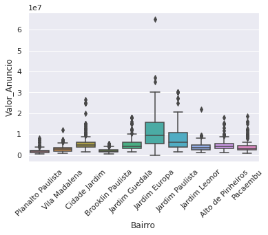
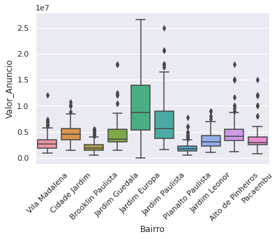
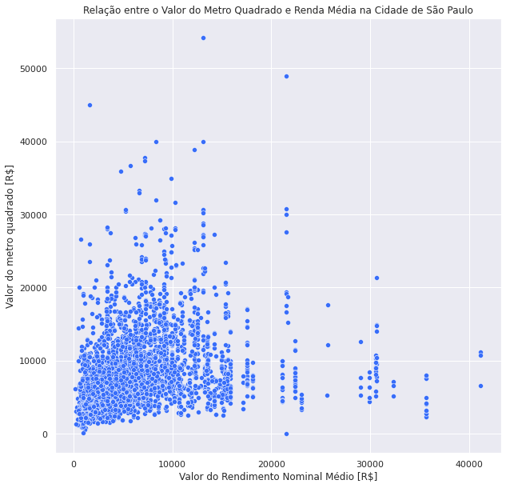

# Imersão Dados #4 Alura

### [Aula 01 - Seu primeiro Colab com Python e Pandas](https://github.com/andreferibeiro/imersao_dados_alura/blob/main/ALURA_IMERS%C3%83O_DADOS_4_Aula_01.ipynb)

Resumo da aula: Primeiros passos utilizando Google Colab como notebook e a Biblioteca Pandas para analisar um banco de dados de imóveis da cidade de São Paulo. Foi possível realizar algumas análises e gráficos simples como o mostrado abaixo com a média da Metragem dos imóveis por Bairro da cidade.

### [Aula 2 - Tratamento de dados e primeiros gráficos](https://github.com/andreferibeiro/imersao_dados_alura/blob/main/ALURA_IMERS%C3%83O_DADOS_4_Aula_02.ipynb)

Resumo da aula: Se a idéia fosse resumir essa aula em duas palavras seria LIMPEZA e GRÁFICOS. Excelente aula de como a limpeza e preparação dos dados para qualquer tipo de análise é imprescidível. Por fim uma série de novos gráficos, entre eles de distribuição, mapas de calor e por fim gráfico de caixas (boxplot) para identificar os outliers.

### [Aula 3 - Gráficos, Time Series e Análise Exploratória](https://github.com/andreferibeiro/imersao_dados_alura/blob/main/ALURA_IMERS%C3%83O_DADOS_4_Aula_03.ipynb)

Resumo da aula: Mais um pouco de conhecimento em gráficos e a tão famosa EDA (análise exploratória de dados), remoção dos  outliers e re-avaliação do dataset.

### [Aula 4 - Missão Impossivel: Cruzando bases de Dados](https://github.com/andreferibeiro/imersao_dados_alura/blob/main/ALURA_IMERS%C3%83O_DADOS_4_Aula_04.ipynb)

Resumo da aula: Talvez a aula mais pesada da Imersão, mas um conteúdo incrível para o cruzamento de diferentes bancos de dados, criando um dataframe resultante com informações de fontes variáveis com a intenção de retirar insights valiosos e preparar os dados para aplicação de Machine Learning.

### Aula 5 - Machine Learning

Resumo da aula: Em breve.

### Conclusão
